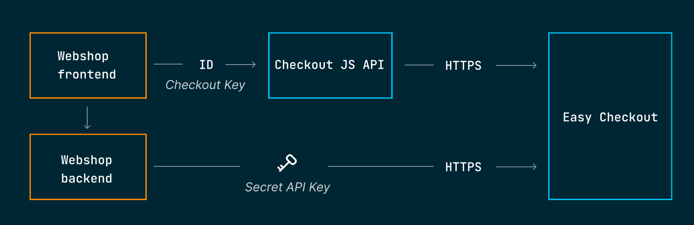

# Integrate Easy Checkout on your website

This guide is for developers who want to add online payments to their website using Easy Checkout.

## Before you start

Before you start you need:

1. An [Easy Portal account](https://portal.dibspayment.eu). See the guide [create account](create-account.md).
2. Your [integration keys](https://portal.dibspayment.eu/integration) for the website you are developing. [Need help](access-your-integration-keys.md)?
3. A running web server which can host static HTML pages and execute server side scripts. We will use PHP in this guide.
4. Basic skills in PHP, HTML, JavaScript, and JSON (JavaScript Object Notation)

## Introduction to Easy Checkout

**Easy** is a platform for online payments. It supports one-time payments and subscriptions (recurring payments). [Payment methods](payment-methods.md) supported by Easy include card, invoice, installments, and digital wallets such as Swish, Vipps, and MobilePay.

**Easy Checkout** is the part of Easy that handles the checkout on your website. You have two options when integrating Easy Checkout on your site: 

- An **embedded checkout** on your site using the [Checkout JS SDK](checkout-js.md). This option allows for more customizations but also requires a little more work initially.
- A **hosted checkout** which is a pre-built checkout page hosted by Nets. This options requires less work on your side but is also less flexible. There might be technical reasons why you cannot use an embedded checkout in your E-commerce system. In that case, the hosted checkout is the right option for you.

This guide demonstrates how to integrate an **embedded checkout** on your website.

The **backend** of your website communicates with **Nets Easy** over REST APIs using your **Secret API Key**. The **frontend** of your website uses the **Checkout JS SDK** provided by Nets to handle the API integration with Easy Checkout. The **frontend** of your site uses the **Checkout Key** to identify your webshop when communicating with Nets.




---
**Important**

The **Secret API key** must never be exposed to the public and should only be passed over encrypted server-to-server communication (HTTPS).

In contrast, the **Checkout key** is only an identifer and can be exposed to the frontend of your site.

---

<!--
## What you are building
-->


<!--
In this guide, you will embed a checkout page to your webshop in six steps:

1. Initiate the checkout from your site (frontend)
2. Create a payment object (backend)
3. Add a checkout page (frontend)
4. Embed the checkout iframe using [Checkout.js](checkout-js.md) (frontend)
5. Add a "payment completed" page (frontend)
6. Test your checkout page
-->


## Step 1: Initiate the checkout from your site (frontend)

The checkout is initiated from the client. We will start implementing the checkout flow from the frontend by adding:

- A **button** that will allow the customer to initiate the checkout
- A JavaScript **event handler** attached to the button

The minimal shopping cart below will serve as a starting point for the payment flow.

```html
<!DOCTYPE html>
<!-- cart.html -->
<html>
  <head>
    <title>Shopping Cart</title>
  </head>
  <body>
    <h1>Shopping Cart</h1>
    <button id="checkout-button">Proceed to Checkout</button>
    <script type="text/javascript">
    var button = document.getElementById('checkout-button');
    button.addEventListener('click', function () {
      var request = new XMLHttpRequest();

      // create-payment.php is implemented in Step 2
      request.open('GET', 'create-payment.php', true); 
      request.onload = function () {
        const data = JSON.parse(this.response);        // If parse error, check output 
        if (!data.paymentId) {                         // from create-payment.php
          console.error('Error: Check output from create-payment.php');
          return;
        }
        console.log(this.response);

        // checkout.html is implemented in Step 3
        window.location = 'checkout.html?paymentId=' + data.paymentId;
      }
      request.onerror = function () { console.error('connection error'); }
      request.send();
    });
   </script>
  </body>
</html>
```

The page contains a checkout button and embeds our custom JavaScript which we will implement next.

Add the following event listener to the checkout button:

```javascript
/* script.js */ 

document.getElementById('checkout-button').addEventListener('click', function () {
  var request = new XMLHttpRequest();
  request.open('GET', 'create-payment.php', true);
  request.onload = function () {
    if (this.status == 200) { 
      // Success!
      console.log('response: ' + this.response);
      const data = JSON.parse(this.response);
      window.location = 'checkout.html?paymentId=' + data.paymentId;
    } else {
      console.log('error: ', this.status); // Ignore errors for now
    }
  }
  request.onerror = function () {
    console.log('connection error');
  }
  request.send();
});

```

When clicking the checkout button, the event handler will send an asynchronous **request** over **HTTP(S)** to the **backend** of your site. If you try clicking the checkout button now, you will receive a **HTTP 404** error since we haven't implemented the backend yet. You can verify this by inspecting the JavaScript Console in your browser.

Let's fix this 404 error and turn to the backend the request to create a payment.

## Step 2: Create a payment object (backend)

Each **payment session** is represented by a **payment object**. In order to start a checkout flow for your customer, you first need to create a payment object and retrieve the `paymentId` referencing that object. Creating a payment object requires your [Secret API key](access-your-integration-keys.md). Therefore, this request has to be initiated from the backend of your site. 

The following backend script will create a new payment object and return the `paymentId` to the frontend:

```php
<?php

$payload = file_get_contents('payload.json');
assert(json_decode($payload) && json_last_error() == JSON_ERROR_NONE);

$ch = curl_init('https://test.api.dibspayment.eu/v1/payments');
curl_setopt($ch, CURLOPT_CUSTOMREQUEST, 'POST');
curl_setopt($ch, CURLOPT_POSTFIELDS, $payload);
curl_setopt($ch, CURLOPT_RETURNTRANSFER, true);
curl_setopt($ch, CURLOPT_HTTPHEADER, array(                                                                         
        'Content-Type: application/json',
        'Accept: application/json',
        'Authorization: <YOUR_SECRET_API_KEY>'));                                                
$result = curl_exec($ch);
$http_code = curl_getinfo($ch, CURLINFO_HTTP_CODE);
echo($result);

?>
```
Replace the text `<YOUR_SECRET_API_KEY>` with your [Secret API key](https://portal.dibspayment.eu/integration).

In this example we simply read a hardcoded JSON object from the file `payload.json` shown below. 
Normally, this would be the place where you dynamically create a JSON object based on your customer's order items.
For now, you can just add a the static JSON file `payload.json` that can be used for testing:

```json
{
  "checkout": {
    "integrationType": "EmbeddedCheckout",
    "url": "https://<YOUR_SERVER>/checkout.html",
    "termsUrl": "https://<YOUR_SERVER>/terms.htmtl"
  },
  "order": {
    "items": [
      {
        "reference": "ref42",
        "name": "Demo product",
        "quantity": 2,
        "unit": "hours",
        "unitPrice": 80000,
        "grossTotalAmount": 160000,
        "netTotalAmount": 160000
      }
    ],
    "amount": 160000,
    "currency": "SEK",
    "reference": "Demo Order"
  }
}
```

The request body includes:

- **Integration type**: specifies whether you want to *embed* a checkout `iframe` on your page or use a pre-built checkout page hosted by Nets.
- **Checkout URL**: The URL to your checkout page. This URL need to match the URL to your checkout page exactly, including protocol (http/https) and the fully qualified domain name (FQDN).
- **Terms URL**: A URL to a page on your site that describes the payment terms for your webshop.
- **Order details**: Includes order items, total amount, and currency

---
**NOTE**

Make sure you replace the line:
```json
    "url": "https://<YOUR_SERVER>/checkout.html",
```
with the **exact URL** to the checkout page (created in the next step), or the page will fail to load later on. Verify the **protocol** (http/https), **server address**, and **port** you are using.

---


This is a minimal example just to get started. There are numerous settings that can be specified when creating or updating a payment object that are not covered here. See the guides [Update order](#update-order), [Add shipping cost](#add-shipping-cost), and the [Payment API reference] for more info.

You should now be able to click the checkout button and thereafter see the `paymentId` printed to the JavaScript console in your web browser. 


---
**Troubleshooting**

If the `paymentId` is not printed to the JavaScript console, you can also try loading the backend script directly from your web browser. In that way, you can read the error messages outputted from the script more easily.
  
---

Now when the backend is implemented it's time to go back to the frontend code and use the `paymentId` to create the checkout page with the payment view.

## Step 3: Add a checkout page (frontend)

It's time to create the HTML page that will embed the checkout `iframe`. Add the following HTML code into a new file:

```html
<!DOCTYPE html>
<!-- checkout.html -->
<html>
 <head><title>Checkout</title></head>
 <body>
  <h1>Checkout</h1>
   <div id="checkout-container-div">
     <!-- checkout iframe will be embedded here -->
   </div>
   <script src="https://test.checkout.dibspayment.eu/v1/checkout.js?v=1"></script>
   <script src="script.js"></script>
 </body>
</html>
```

The HTML code contains a few things to pay attention to:

- The container element `<div id="checkout-container-div">` is the place where we eventually will embed the checkout `iframe`. 
- Two JavaScripts are loaded: `checkout.js` from **Nets** and our own `script.js` which we will implement in the next step.
- Since we are using the [test environment](test-environment.md) in this guide, `checkout.js` is loaded from `test.checkout.dibspayment.eu`. When using the live environment, you should instead use `checkout.dibspayment.eu`.

The `checkout.html` page should always be requested with a URL parameter called `paymentId` since the `paymentId` is needed in order to identify the current payment session when communicating with Nets. 


## Step 4: Generate checkout iframe using the Checkout JS SDK

It's time to create the JavaScript that will communicate with Nets Easy using the Checkout JS SDK.

Create a new file and add the following JavaScript code:

```javascript
/*
  checkout-helper.js
*/

document.addEventListener('DOMContentLoaded', function () {
  const urlParams = new URLSearchParams(window.location.search);
  const paymentId = urlParams.get('paymentId');
  if (paymentId) {
    const checkoutOptions = {
      checkoutKey: '<YOUR_CHECKOUT_KEY>', // Replace!
      paymentId: paymentId,
      containerId: "checkout-container-div",
    };
    const checkout = new Dibs.Checkout(checkoutOptions);
    checkout.on('payment-completed', function (response) {
      window.location = 'completed.html';
    });
  } else {
    console.log("Expected a paymentId");   // No paymentId provided, 
    window.location = 'cart.html';         // go back to cart.html
  }
});
```

Replace `<YOUR_CHECKOUT_KEY>` with your [checkout key](https://portal.dibspayment.eu/integration) for the [test environment](test-environment.md).

For the `checkout.js` script to load correctly, it's important that you have specified the correct URL to your checkout page in [Step 3](#step-3-add-a-checkout-page-frontend).

The checkout object will fire the event `'payment-completed'` once the payment has completed. The callback function we provide navigate to `completed.html` which we will create in the next step.


---
**Troubleshooting**

- Make sure you are using the correct [integration keys](https://portal.dibspayment.eu/integration) for the [test environment](test-environment.md).
- For the `checkout.js` script to load correctly, it's important that you have specified the correct URL to your checkout page [Step 3](#step-3-add-a-checkout-page-frontend).  
---


## Step 5: Add a "Payment completed" page

Add the following page to your site:

```html
<!DOCTYPE html>
<!-- completed.html -->
<html>
  <head>
    <title>Payment completed</title>
  </head>
  <body>
    <h1>Payment completed!</h1>
    <a href="cart.html">Try again</a>
  </body>
</html>
```

That's it! Now it's time test and verify that your new embedded checkout page is working.

## Step 6: Test your checkout page

You should now have a rudimentary checkout page that can be tested using the test cards that can be found at the page [Test environment](test-environment.md).

Here is how you test your new checkout page:

1. Reload the shopping cart page and click the "Proceed to Checkout" button
3. Fill out the address form using your **email**, **phone**, and **postal code(())
4. Insert any of the [sample card numbers](#test-cards) and click the "Pay" button
5. Play around! 

The simulated payment processing should now start and eventually get you back to the "Payment completed" page you created in the previous step.


---
**Troubleshooting**

- Verify that you are using the correct [integration keys](access-your-integration-keys.md) for the [test environment](test-environment.md).
- `checkout.js` will fail to load unless you provide the correct checkout URL in the JSON body specified in [Step 2](#step-2-create-a-payment-object-backend) when creating the `paymentId`.
- When changing the checkout URL, make sure you reload shopping cart page so that a new payment session is created (and a new `paymentId`).
---

---
**Congratulations!**
You have now integrated an embedded checkout!

---


## Next steps

- [Customize checkout page](customize-payment-form.md)
- Add shipping cost
- Add payment methods
- Manage subscriptions

