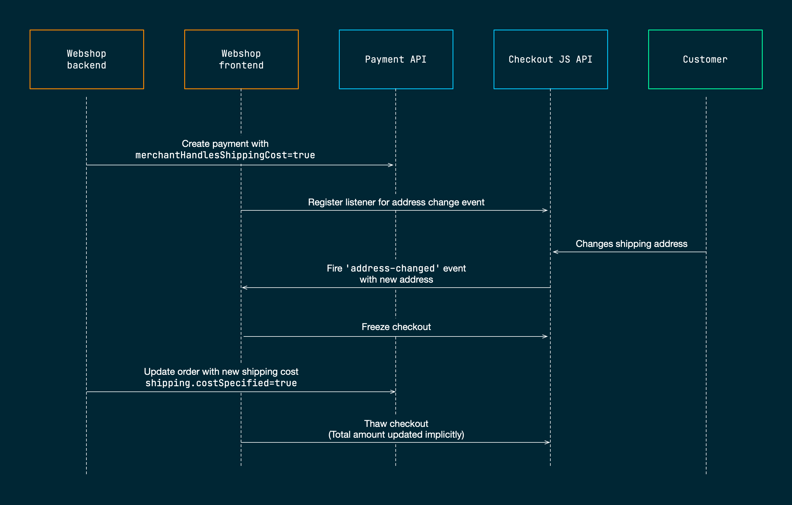

# Add shipping costs

It's possible to add shipping cost to your customer's order. Shipping costs are usually affected at the end of the payment flow when your customer's address is specified. To handle this, your site need to interact with the Easy Checkout during ongoing the payment session.

Shipping costs are added to the order as a regular item in the `order` object passed to the Payment API. However, 
to enable destination based shipping cost, you must set the flag `merchantHandlesShippingCost` to `true` when creating the payment object using the Payment API. In this way, Easy Checkout will 





As a part of the shipping cost feature, we have implemented generic cart-updates. 

This guide will show you how to update the order items in an ongoing payment session using the Payment API. 


This method can be used to add or remove items to the cart, change the amount, quantity, etc on existing items or add or update shipping cost. Please note that shipping cost is an order line like any other order line. If the merchant handles shipping cost, the update cart must be invoked with shipping.costSpecified as shown in the example body:


## Before you start
This guide assumes that you already have a 

Merchant can update the order items in a cart by utilizing the new api-method: PUT "v1/payments/{paymentId}/orderitems". 


This method can be used to add or remove items to the cart, change the amount, quantity, etc on existing items or add or update shipping cost. Please note that shipping cost is an order line like any other order line. If the merchant handles shipping cost, the update cart must be invoked with shipping.costSpecified as shown in the example body:


A typical scenario where you want to update an existing payment session is when the customer changes the quantity of an item. 


Whenever


## Step 1: Set merchantHandlesShippingCost (backend)

To be able to handle destination based shipping costs, you need to pass the flag `merchantHandlesShippingCost` when creating the payment object using the method `POST /vi/payments` of the Payment API.

When the backend of your site creates the creating the payment object 
merchantHandlesShippingCost

Add the flag `merchantHandlesShippingCost` when creating the payment object using the method `POST /vi/payments` of the Payment API. The following JSON object serves as an example:

```json
{
  "order": {
      "items": [
          {
              "reference": "42",
              "name": "Demo product",
              "quantity": 2,
              "unit": "hours",
              "unitPrice": 80000,
              "grossTotalAmount": 160000,
              "netTotalAmount": 160000
          }
      ],
      "amount": 160000,
      "currency": "SEK",
      "reference": "Demo Order"
  },
  "checkout": {
      "integrationType": "EmbeddedCheckout",
      "url": "https://<YOUR_SERVER>/checkout.html",
      "termsUrl": "https://<YOUR_SERVER>/terms.html",
      "shipping": {
        "countries": [],
        "merchantHandlesShippingCost": true
      }
  }
}
```

By setting `merchantHandlesShippingCost` to `true`, Easy Checkout will not proceed with a payment unless a shipping cost has been added to the order.

## Step 2: Register an `address-changed` listener (frontend)

Add a listener on the `checkout` object so that you get informed whenever your customer is updating the address fields on the payment form:

```javascript
// ...
checkout.on('address-changed', function (address) {
  if (address) {
    checkout.freezeCheckout();
    var request = new XMLHttpRequest();
    request.open("POST", 'update-shipping-cost.php');
    request.setRequestHeader("Content-Type", "application/json;charset=UTF-8");
    const body = {
      paymentId: paymentId,
      postalCode: address.postalCode,
      countryCode: address.countryCode
    };
    request.onload = function () {
      console.log(this.response);
      checkout.thawCheckout();
    }
    request.onerror = function () { console.error('connection error'); }
    request.send(JSON.stringify(body));
  }
});
  // ...

```
Some things to note in the event handler:
- The event handler is being called whenever the customer updates the address
- The new address is passed as an argument to the event handler
- We freeze the checkout by calling `freezeCheckout()` 
- We inform our backend that the shipping cost should be recalculated and updated 
- When the backend has updated the order with a new shipping cost we resume the checkout by calling `thawCheckout()`.


Step 3: Recalculate shipping cost and update order (backend)

In this step we know that the address has been updated by the customer and the frontend is waiting for the backend to calculate a new shipping cost and updating the payment object we created in step 1.

1. Recalculate the shipping cost
2. Update the `items` object in the payment object by using the method `PUT /v1/payments/{paymentId}/orderitems` of the Payment API.

The following code shows how calculate a new random shipping cost and update the shipping cost item in the order:

```php
<?php

$inputJSON = file_get_contents('php://input');
$body = json_decode($inputJSON, TRUE);

$paymentId = $body['paymentId'];
$postalCode = $body['postalCode'];
$countryCode = $body['countryCode'];

// Update shipping cost to some new random value
// Normally, the JSON object would have been
// created dynamically from the customer's 
// shopping cart
$payloadJSON = file_get_contents('shipping-cost.json');
$payload = json_decode($payloadJSON, true);
$shippingCost = rand(1000, 5000);
$totalAmount = 160000 + $shippingCost;
$payload['amount'] = $totalAmount;
$payload['items'][1]['grossTotalAmount'] = $shippingCost;

$ch = curl_init('https://test.api.dibspayment.eu/v1/payments/' . $paymentId . '/orderitems');
 curl_setopt($ch, CURLOPT_CUSTOMREQUEST, 'PUT');
 curl_setopt($ch, CURLOPT_POSTFIELDS, json_encode($payload));
 curl_setopt($ch, CURLOPT_RETURNTRANSFER, true);
 curl_setopt($ch, CURLOPT_HTTPHEADER, array(                                                                         
         'Content-Type: application/json',
         'Accept: application/json',
         'Authorization: b17758ca569047bdb574aaa2c32f1446'));                                                
 $result = curl_exec($ch);
 $http_code = curl_getinfo($ch, CURLINFO_HTTP_CODE);
 echo($result);

?>
```
The code assumes that we are using the following hard-coded JSON file:

```json
{
  "amount": 162000,
  "items": [
    {
      "reference": "42",
      "name": "Demo product",
      "quantity": 2,
      "unit": "hours",
      "unitPrice": 80000,
      "grossTotalAmount": 160000,
      "netTotalAmount": 160000
    },
    {
      "reference": "shipping-cost",
      "name": "Delivery service",
      "quantity": 1.0,
      "unit": "NA",
      "unitPrice": 0,
      "taxRate": 0,
      "taxAmount": 0,
      "grossTotalAmount": 2000,
      "netTotalAmount": 0
    },

  ],
  "shipping": {
    "costSpecified": true
  }
}
```

By adding a new order item which corresponds to the shipping cost, and, by setting the flag `costSpecified` to `true`, Easy Checkout will allow the payment to proceed once the checkout is resumed by our frontend (see `thawCheckout()` in the previous step).

