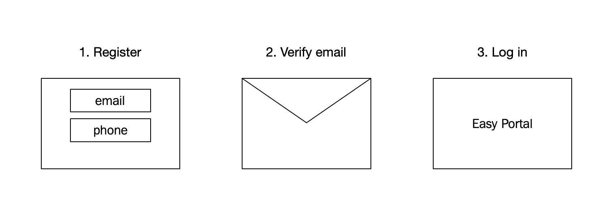

# Create account 

In order to test and use Easy Checkout you need an Easy Portal account. If you don't already have an account, you can [register a new account](https://portal.dibspayment.eu/registration) in a few easy steps.

Creating an account comes at no cost and new accounts are placed in test mode by default. When you have integrated Easy Checkout to your site and are ready to go live, you can apply for a live account.

## See also

- [Access your integration keys](access-your-integration-keys.md)
- [Why does Nets need my email and phone number?](https://www.example.com/faq/)
