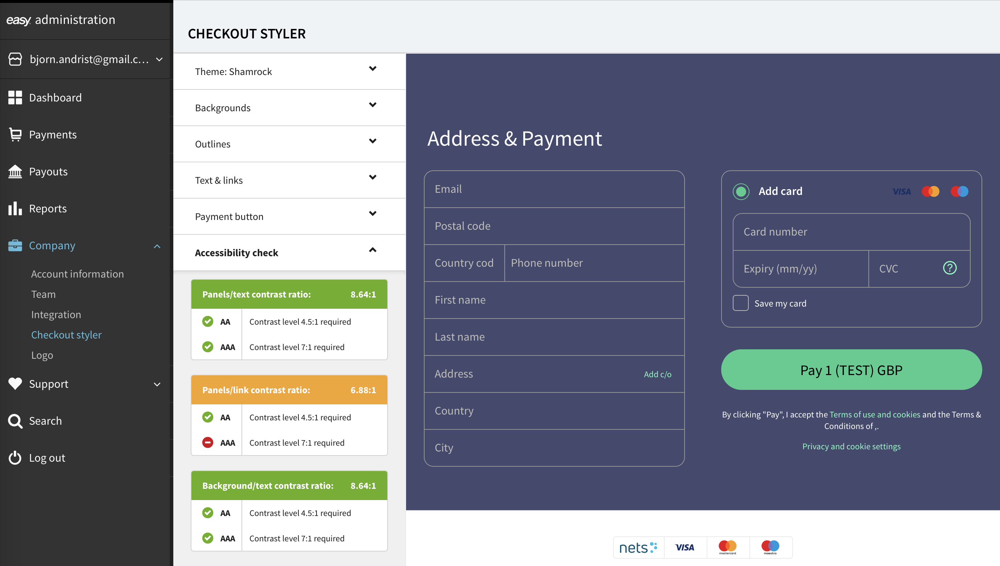
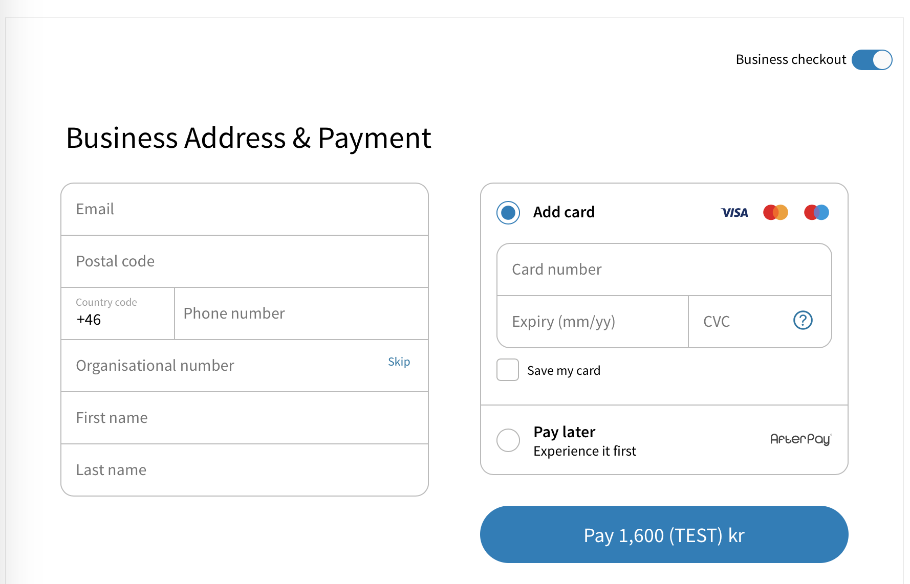

# Customize Checkout Page


## Who is this guide for?

This guide is for developers who want to customize the style and behavior of an Easy Checkout page.

## Before you start

This guide assumes that you already have integrated Easy Checkout on your website. 
If you are not familiar with Easy Checkout and the Easy portal, please read the guide 
[Direct Integration](direct-integration-web.md) first. 


## Set a display language

You can change the language of the checkout page by changing the 

## Configure UI theme

The style of the checkout page can be customized which makes it possible have the checkout page match the style of your site.

You have two options when it comes to styling:
- Use the [Checkout styler]](https://portal.dibspayment.eu/account/checkout-styler) in Easy portal (recommended)
- Use the [Checkout JS API](https://example.com/api) if you are using embedded checkout page

### Checkout styler

Both options offer the same set of styling properties. 
However, the Checkout styler is easier to use and also contains an accessibility tool to verify that the color scheme you have selected has sufficient contrast ratio. 




### Specify theme using the Checkout JS API

If you are using an embedded checkout page, you can pass a `theme` object to the `Checkout` constructor or to the method `setTheme()`. 
The following example changes the background color of the panel:

```json

var checkout = new Checkout();

```


### The anatomy of the checkout form


Panel
Footer


For example, if you have a site with a dark background and light foreground colors, you might want to adjust the styling of the embedded checkout form so that it matches the rest of your site.


The following example shows how you can specify a dark theme with custom 


## Customize form data fields

Easy Checkout supports two types of customers:

- **Private** customers or **B2C** (Business-to-Consumer)
- **Business** customers or **B2B** (Business-to-Business)

### Private customers (B2C)
Private customers registers with: **email address**, **postal code**, **personal security number**, and **phone number**.
Easy Checkout does a lookup and retrieves the **first name**, **last name** and the **civil registration address**.


### Business customers (B2B)

The flow for registering as a business is very similar to that of B2C. For Norway and Denmark, the form includes **company name** in addition to the information collected from a private consumer. For the Swedish flow, business customers are provided the option to do a lookup on **organization number** and retrieve the address automatically.

B2B customers can use the same payment methods as B2C customers except **installments** and **invoice campaigns**, which are only available for private customers.


## Configure Easy Checkout to handle B2B and B2C customers

By default, Easy Checkout will assume that your customer is a **private customer**. 
If you want to provide support for business customers on your site, you need to specify
this using the [Payment API](payment-api.md) when creating the **payment session object** 
from the **backend** of your site. 

There are three ways you can configure customer type:

- **B2C** - only allow private customers
- **B2B** - only allow business customers
- **B2C** and **B2B** - a switch is added to the checkout page so that your customer can choose between a **B2B** or **B2C**.

The following image shows the switch on the checkout page which provides the customer the ability to choose between **Business checkout** or a **Private checkout**:



You can also specify which type that should be loaded by **default** when presenting the payment form.

A B2B customer is separated from a B2C customer, so that consumers can separate their private and business Easy profiles. In practice this means that there is a B2B selector present in the checkout when a merchant has enabled both consumer types. The information stored on a private consumer will not be present for a Business consumer.

```json
"consumerType": {
        "supportedTypes": [ "B2C", "B2B" ],
        "default": "B2C"
    }  
```

In order to enable B2B for 
Merchants need to enable B2B for it to display in the checkout on their sites. For modules and partner integrations that have built-in support for B2B they can easily do this in their portals. 

For direct integrations, merchants need to specify this using the Payment API.

Merchants have flexibility when selecting their customer types. It's possible to choose to have B2C only, B2C and B2B, or even B2B only. Additionally, merchants can select which checkout loads as default on their site, so that you can tailor the user experience depending on your business model, which is a feature unique to Easy.


A B2B customer is separated from a B2C customer, so that consumers can separate their private and business Easy profiles. In practice this means that there is a B2B selector present in the checkout when a merchant has enabled both consumer types. The information stored on a private consumer will not be present for a Business consumer.


The Payment API consumer type
Business-to-business 


Easy Checkout can handle both allows for **business* (**B2B**) and private consumers (**B2C**) to checkout with ease and smoothness through the few actions needed to complete a transaction.
The core functionality for businesses is the same as for private consumers, but with some differences in the checkout flow.


The checkout works exactly the same for B2C as for B2B, it stores addresses, cards and invoice and you have the option to be remembered on one or several devices.
This mean that returning B2B and B2C consumers will enjoy the same speed of checkout.


A **business consumer**
The flow for registering as a business is very similar to that of B2C. For Norway and Denmark, the form includes Company name in addition to the information collected from a private consumer. For the Swedish flow the business consumer will be enabled to do a lookup on organization number and retrieve the address.


A B2B invoice has some limitations on the Easy platform as checkout security is based on only being able to ship to officially registered addresses, B2B companies can only pay with invoice when shipping to their headquarter. A key difference from B2C is that the due date is set to 30, not 14.

B2B payments will be presented to merchants in the portal as any other payment, with the exception that Company Name will also be there. All other functionality is the same.

 
## Language


## Theme


